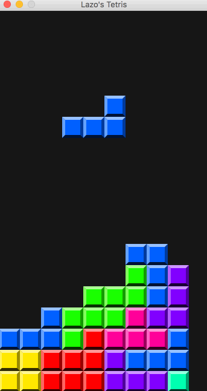

# Tetris
A tile matching puzzle video game.

# Instructions
After downloading, navigate into the Tetris folder and type the following commands to run the game:
```
javac Window.java
java Window
```

# Gameplay

Use the left and right arrow keys to move the pieces that are falling. The down arrow key speeds up the fall, the up arrow key rotates the piece, and the ENTER button drops the piece right to the floor.



When the player loses the program exits and the final score is printed to the terminal.
